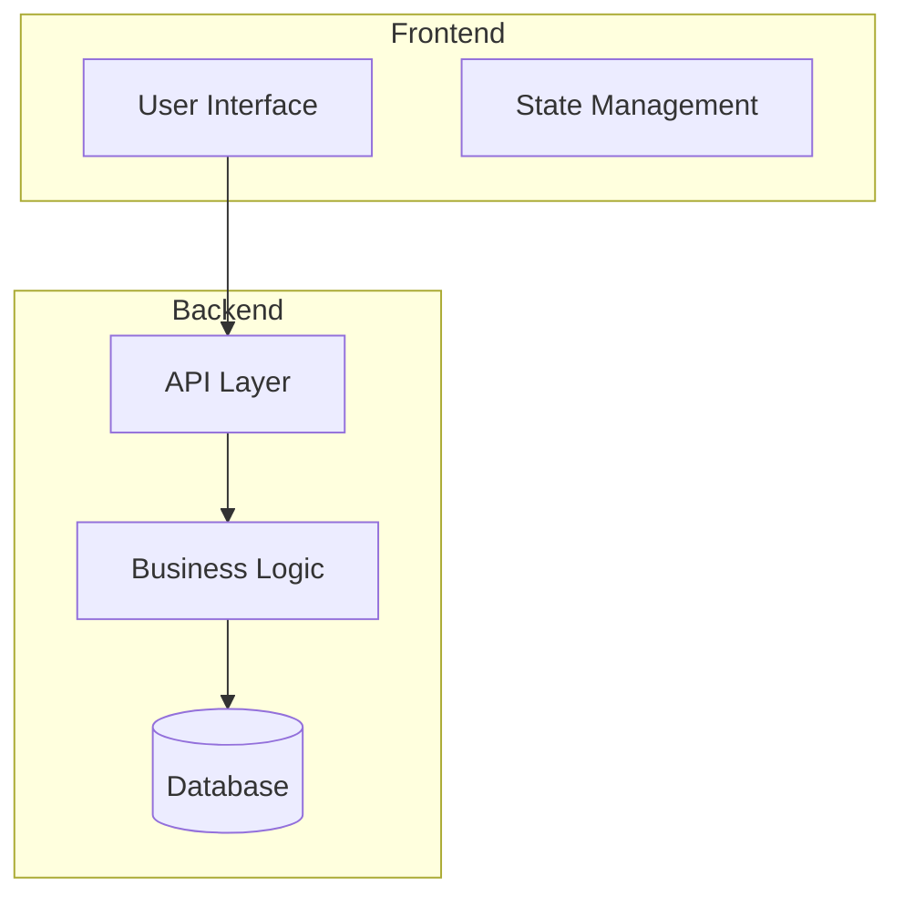
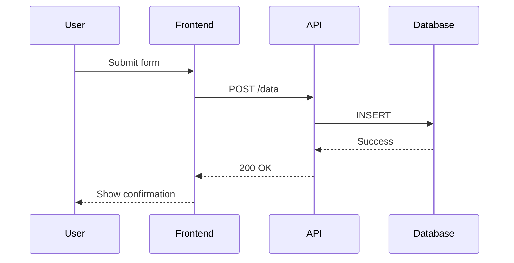
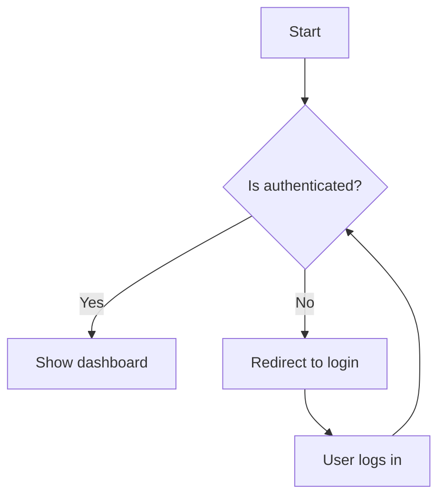
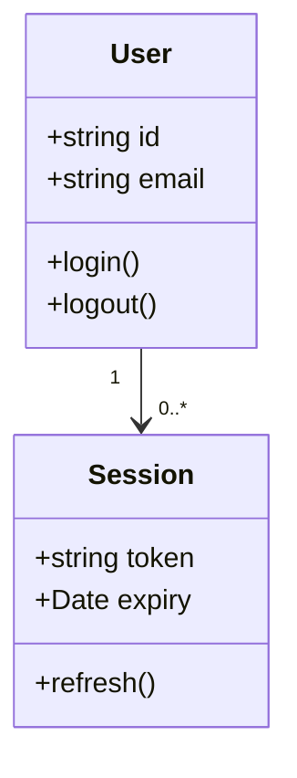
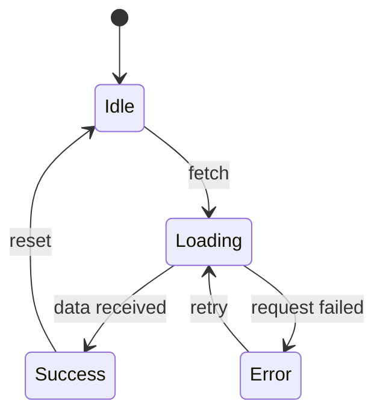

# Document

Generate or update project documentation with mermaid diagrams.

## Arguments

- **`--output <path>`** (optional): Specify output file path
- **`[context]`** (required): Description of what to document

## Objective

Generate or update project documentation with appropriate mermaid diagrams, following existing documentation conventions and ensuring proper formatting.

## Core Principles

- Use appropriate mermaid diagram types for visual clarity
- Follow existing project documentation style and conventions
- Include practical examples with code snippets
- Link to related documentation when available
- Run markdownlint-cli2 to ensure proper formatting
- Validate mermaid syntax before saving

## Instructions

1. **Parse Request**
   - Analyze the `[context]` to understand documentation needs
   - Determine documentation type:
     - API documentation
     - Architecture documentation
     - Feature documentation
     - Setup/installation guides
     - Troubleshooting guides
     - Component documentation

2. **Analyze Existing Documentation**
   - Check for existing docs directory structure
   - Identify related documentation files
   - Understand current documentation conventions
   - Check for documentation templates

3. **Explore Codebase**
   - Launch explore agents to understand relevant code
   - For API docs: find API routes, handlers, types
   - For architecture: understand component relationships
   - For features: trace feature implementation

4. **Generate Documentation**
   - Create markdown documentation
   - Include mermaid diagrams where appropriate:
     - Architecture diagrams (C4, component diagrams)
     - Sequence diagrams (for flows and interactions)
     - Flowcharts (for decision logic)
     - Class diagrams (for object models)
     - State diagrams (for state machines)
   - Follow existing documentation style if present

5. **Format Output**
   - Run `npx markdownlint-cli2 --fix <file>` to format
   - Handle formatting errors gracefully
   - Report any issues that couldn't be auto-fixed

6. **Save Documentation**
   - Save to `--output` path if specified
   - Otherwise suggest appropriate location based on content type
   - Inform user of saved file path

## Mermaid Diagram Types

### Architecture Diagrams



### Sequence Diagrams



### Flowcharts



### Class Diagrams



### State Diagrams



## Output Guidance

Present the saved documentation path and a brief summary:

```
Documentation saved to docs/architecture.md

## Summary
- Type: Architecture documentation
- Diagrams: 3 (component, sequence, flowchart)
- Sections: 5
- Examples: 2 code snippets

The documentation has been formatted with markdownlint-cli2.
```

Generated documentation should follow this structure:

````markdown
# [Title]

## Overview

Brief description of what this document covers.

## [Main Sections]

Detailed content with code examples and diagrams.

### Diagrams

```mermaid
[Appropriate diagram type]
```
````

## Examples

Practical usage examples.

## Related

Links to related documentation.
```

## Important Notes

- Validate mermaid syntax before saving documentation
- Always run markdownlint-cli2 formatting to ensure consistency
- Include practical examples in all documentation
- Follow existing documentation conventions in the project
- Keep diagrams as simple as possible while conveying the necessary information
